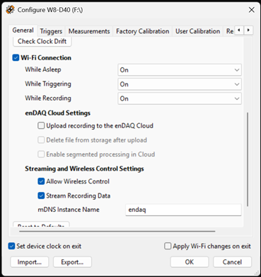

=========================
``endaq.device`` and MQTT
=========================
.. default-domain:: py
.. currentmodule:: endaq.device

Controlling and communicating with Wi-Fi enabled enDAQ devices is done via `MQTT <https://mqtt.org/>`_,
a lightweight protocol widely used in IoT applications.

A full setup for communicating with an enDAQ device over MQTT consists of three parts:

1. An **MQTT Broker**. ``endaq.device`` requires the presence of a running MQTT broker supporting version 5.x of the protocol. The MQTT broker is *not* included in ``endaq.device`` and must be downloaded and installed separately. One such broker is `Mosquitto <https://mosquitto.org/>`_; its open source version (EPL/EDL license) is cross-platform, small, and can be run locally or on a server. *The specific details of setting up the MQTT broker are beyond the scope of this document; consult the Broker's documentation for more information.*

2. An **enDAQ Device Manager**. :class:`~.mqtt.manager.MQTTDeviceManager` is a thread/process, typically running in the background, that keeps track of devices connected via MQTT. It connects to the Broker and provides enDAQ-specific functionality, such as aiding in device discovery and tracking sleeping devices. Another feature the Device Manager provides is *advertising* (via mDNS/zeroconf), so the enDAQ devices and :class:`~.mqtt.mqtt_interface.MQTTConnector` (described below) can find the Broker. This can be run on the same machine as the MQTT Broker; for small setups and tests, it can be run locally.

3. An **MQTT Connector**. :class:`~.mqtt.mqtt_interface.MQTTConnector` is the user-facing component that handles communicating with the Broker and Device Manager. Its primary function is creating and handling :class:`~.Recorder` instances for MQTT-enabled devices.

Each component can be run on different machines, but the machines must be on the same network.

Quick Start
~~~~~~~~~~~

Start the MQTT Broker
---------------------
The specifics of how you start the Broker depend on which Broker you installed, and how and where it was installed. These instructions assume Mosquitto has been installed and is not currently running.

Create a ``mosquitto.conf`` file
''''''''''''''''''''''''''''''''
If you have not previously created a Mosquitto configuration file, you will need to do so. Here is a simple ``mosquitto.conf`` file:

.. code-block::

    listener 1883 0.0.0.0
    allow_anonymous true

Start Mosquitto in 'user space'
'''''''''''''''''''''''''''''''
Starting Mosquitto in a standard user process (as opposed to running as a system service) is nearly identical in Linux, MacOS, and Windows. On a shell command line, enter:

.. code-block::

    mosquitto -v -c mosquitto.conf

* In Windows, you may need to explicitly state the path to the ``mosquitto`` executable, e.g., ``'C:\Program Files\mosquitto\mosquitto.exe'``
* ``-v`` turns on verbose output and is optional.
* ``-c`` specifies the confgiguration file to use. If you are not in the directory containing your ``mosquitto.conf``, you will need to provide its full path.

Start the MQTT Device Manager and Advertising
---------------------------------------------
On the command line in another shell/terminal window, enter:

.. code-block::

    python -m endaq.device.mqtt.manager

- If the MQTT Broker is running on a different computer, you will need to specify it by name or IP address, e.g.:
  ``python -m endaq.device.mqtt.manager -a 192.160.0.100``

Configure the enDAQ device
--------------------------

.. Important::
  These instructions will change once the firmware with MQTT functionality is finalized.

1. On your enDAQ device, in the `SYSTEM` directory, create an empty text file called `devtest.txt`. Note: if running Windows and 'Hide extensions of known types' is on (the default), the file should appear as `devtest`.
2. Unplug the device, and plug it in again.
3. In the enDAQ Lab Configure Device dialog, General tab, check *Wi-Fi Connection*. If already on, skip to step 6.
4. Click 'OK' to exit the dialog, and when prompted to reset the device, click 'Yes'.
5. Once the device reappears in the list of devices to configure, configure it again.
6. In the 'Wi-Fi' tab, select your Wi-Fi access point and enter its password (if not already selected).
7. In the 'General' tab, set the Wi-Fi options to match the image above:

  - **'While Asleep'/'While Triggering'/'While Recording' lists:** All *On*
  - **'Endaq Cloud Settings' group:** All *unchecked*
  - **'Streaming and Wireless Control Settings' group:** All *checked*
  - **'mDNS Instance Name' field:** `enDAQ Remote Interface`

8. Click 'OK' to exit the dialog. If prompted to reset the device, click 'Yes'. If not prompted to reset, unplug the device and plug it in again.

Note: With the 'While...' options set to 'On', Wi-Fi will be active while the device is unplugged, consuming a small amount of battery power.

Create an MQTTConnector and get a Recorder
------------------------------------------
:class:`~.mqtt.mqtt_interface.MQTTConnector` handles communication with the MQTT broker and manages MQTT-enabled instances of :class:`~.Recorder`. It provides methods equivalent to the standard functions :func:`~.findDevice` and :func:`getDevices`.

In the Python interactive console/REPL (run from the command line in another shell/terminal window, through an IDE, etc.):

.. code-block:: python

    >>> from endaq.device.mqtt.mqtt_interface import MQTTConnector
    >>> con = MQTTConnector.find()
    >>> con.getDevices()
    [<EndaqW W8-E100D40 "Test device #1" SN:W0016827 (remote)>]
    >>>

